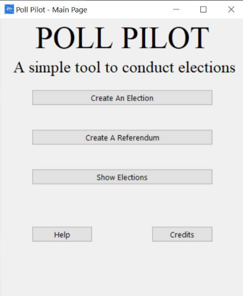
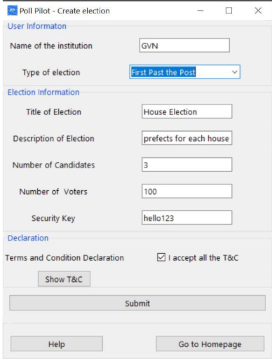
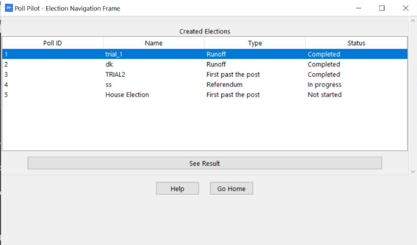

# Poll Pilot

This project aims at creating a program that can be used to conduct polls and referendums

## Running the program

Install the required dependencies using pip:

```bash
pip install tkinter pycrypto
```

Simply run main.py

```bash
python3 main.py
```

## Contributors

- [Devansh Kandpal](https://github.com/0xDevansh)
- [Atharv Dubey](https://github.com/Atharv-Dubey)

## Screenshots



